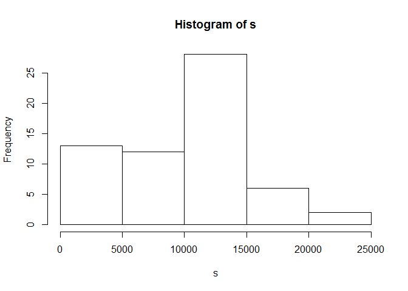
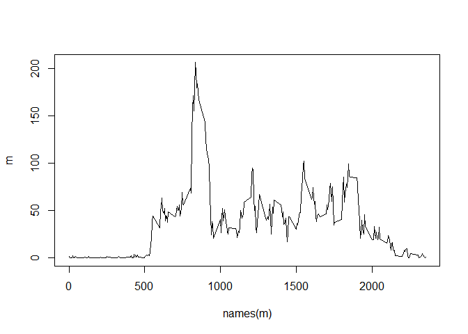
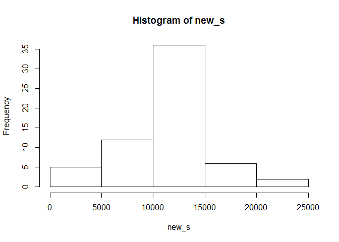

# Reproducible Research: Peer Assessment 1


## Loading and preprocessing the data


```r
data = read.csv("activity/activity.csv")
str(data)
```

```
'data.frame':	17568 obs. of  3 variables:
 $ steps   : int  NA NA NA NA NA NA NA NA NA NA ...
 $ date    : Factor w/ 61 levels "2012-10-01","2012-10-02",..: 1 1 1 1 1 1 1 1 1 1 ...
 $ interval: int  0 5 10 15 20 25 30 35 40 45 ...
```


## What is mean total number of steps taken per day?

1.Calculate the total number of steps taken per day


```r
attach(data)
s = tapply(steps, date, function(x) {
    sum(x, na.rm = T)
})
s
```

```
2012-10-01 2012-10-02 2012-10-03 2012-10-04 2012-10-05 2012-10-06 
         0        126      11352      12116      13294      15420 
2012-10-07 2012-10-08 2012-10-09 2012-10-10 2012-10-11 2012-10-12 
     11015          0      12811       9900      10304      17382 
2012-10-13 2012-10-14 2012-10-15 2012-10-16 2012-10-17 2012-10-18 
     12426      15098      10139      15084      13452      10056 
2012-10-19 2012-10-20 2012-10-21 2012-10-22 2012-10-23 2012-10-24 
     11829      10395       8821      13460       8918       8355 
2012-10-25 2012-10-26 2012-10-27 2012-10-28 2012-10-29 2012-10-30 
      2492       6778      10119      11458       5018       9819 
2012-10-31 2012-11-01 2012-11-02 2012-11-03 2012-11-04 2012-11-05 
     15414          0      10600      10571          0      10439 
2012-11-06 2012-11-07 2012-11-08 2012-11-09 2012-11-10 2012-11-11 
      8334      12883       3219          0          0      12608 
2012-11-12 2012-11-13 2012-11-14 2012-11-15 2012-11-16 2012-11-17 
     10765       7336          0         41       5441      14339 
2012-11-18 2012-11-19 2012-11-20 2012-11-21 2012-11-22 2012-11-23 
     15110       8841       4472      12787      20427      21194 
2012-11-24 2012-11-25 2012-11-26 2012-11-27 2012-11-28 2012-11-29 
     14478      11834      11162      13646      10183       7047 
2012-11-30 
         0 
```

2.Make a histogram of the total number of steps taken each day


```r
hist(s)
```

 

3.Calculate and report the mean and median of the total number of steps taken per day


```r
mean(s)
```

```
[1] 9354.23
```

```r
median(s)
```

```
[1] 10395
```


## What is the average daily activity pattern?

1.Make a time series plot of the 5-minute interval (x-axis) and the average number of steps taken, averaged across all days (y-axis)


```r
m = tapply(steps, interval, function(x) {
    mean(x, na.rm = T)
})
plot(names(m), m, type = "l")
```

 

2.Which 5-minute interval, on average across all the days in the dataset, contains the maximum number of steps?


```r
m[which.max(m)]
```

```
     835 
206.1698 
```

We can see the interval of 835 contains the maximum number of steps which is 206.2.


## Imputing missing values

1.Calculate and report the total number of missing values in the dataset (i.e. the total number of rows with NAs)


```r
sum(!complete.cases(data))
```

```
[1] 2304
```

2.Devise a strategy for filling in all of the missing values in the dataset. 


```r
index = !complete.cases(data)  #find the index of rows which contains missing values.
new_data = data
new_data$steps[index] = m[as.character(interval[index])]  #use the mean for that 5-minute interval to fill the missing values.
```

3.Create a new dataset that is equal to the original dataset but with the missing data filled in.


```r
head(new_data)  #show a part of the new dataset
```

```
      steps       date interval
1 1.7169811 2012-10-01        0
2 0.3396226 2012-10-01        5
3 0.1320755 2012-10-01       10
4 0.1509434 2012-10-01       15
5 0.0754717 2012-10-01       20
6 2.0943396 2012-10-01       25
```

```r
sum(!complete.cases(new_data))  #check if there are still missing values
```

```
[1] 0
```

4.Make a histogram of the total number of steps taken each day and Calculate and report the mean and median total number of steps taken per day


```r
new_s = with(tapply(steps, date, sum), data = new_data)
hist(new_s)
```

 

```r
mean(new_s)
```

```
[1] 10766.19
```

```r
median(new_s)
```

```
[1] 10766.19
```

These values obviously differ from the estimates from the first part of the assignment. 

The impact of imputing missing data on the estimates of the total daily number of steps is that the result looks more reasonable and the distrubition of histogram looks normal. 

## Are there differences in activity patterns between weekdays and weekends?

1.Create a new factor variable in the dataset with two levels – “weekday” and “weekend” indicating whether a given date is a weekday or weekend day.


```r
new_data$date = as.Date(new_data$date)
head(weekdays(new_data$date))
```

```
[1] "星期一" "星期一" "星期一" "星期一" "星期一" "星期一"
```

```r
new_data$week = ifelse(weekdays(new_data$date) %in% c("星期六", "星期日"), print("weekend"), 
    print("weekday"))
```

```
[1] "weekend"
[1] "weekday"
```


2.Make a panel plot containing a time series plot (i.e. type = "l") of the 5-minute interval (x-axis) and the average number of steps taken, averaged across all weekday days or weekend days (y-axis).


```r
library(lattice)
new_m = with(aggregate(steps, list(interval, week), mean), data = new_data)
names(new_m) = c("interval", "week", "steps")
with(xyplot(steps ~ interval | week, layout = c(1, 2), type = "l"), data = new_m)
```

 


